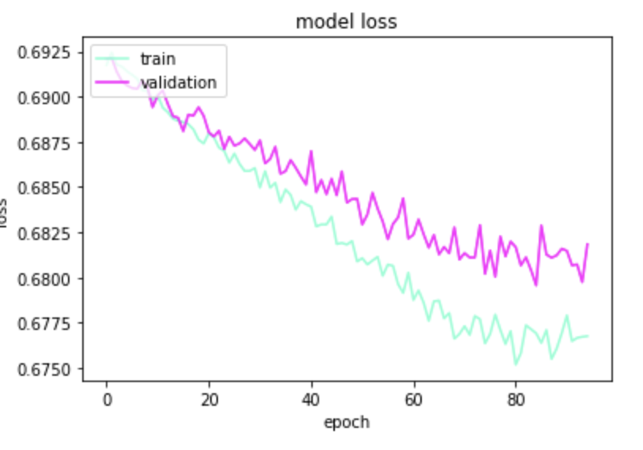
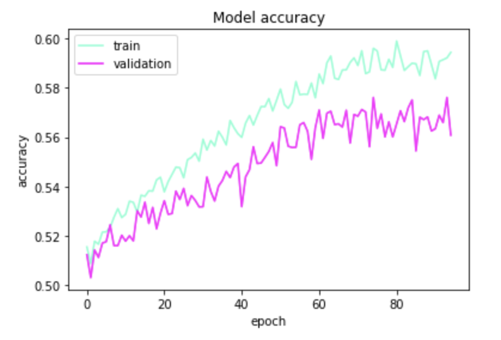

# its_all_in_the_family

## Motivation
Identifying images through a picture is a very interesting topic. It becomes even more interesting by going one step further and differentiating between images. This project focuses on identifying unique features in images of faces and classfying these images as being blood related or not. This idea brings forth much real world implications and neural network theory advancements.

## Faces Dataset
The training and test images can be found through the "data/" path.

The images were obtained from a publicly open dataset called Faces in the Wild (http://vis-www.cs.umass.edu/lfw/). The dataset consists of 1000 different families with 18,660 individual images of faces that have already been resized and face centered with each other.

One caveat to this dataset is that every person did not have an equal amount of images. Some had 1 while others had 50 or more. Similarly, some families had more images than others e.g. family F0601 (The Royal Family) with 776 photos which is 6.27% of all the photos, comparitively to the average which was around 26 photos. This imbalance however is not large enough that it would impose a bias within the training set.

## Method
The method that is employed to classify the faces is the method of using Convolutional Neural Networks(CNN). More specifically, this project focuses on implementing a Siamese CNN. Siamese CNNs was chosen for its advantages over CNNs. As much of the classes, which were the families, was on average 26 photos, there wasn't much data to go for in terms of learning unique features. Siamese CNNs allowed for better classifications as its purpose was to focus its attention on two inputs. Regular CNNs are great at differentiating between photos and identifying what is e.g. hair, or even a mouth in photos. However, this problem of identifying whether two people are blood related through images is best solved by looking at similarities between the images and Siamese CNNs perform much better in that field.

The basic idea of Siamese CNNs is inputting two images on seperate CNNs which have the same architecture. These two sepearte CNNs output a feature vector corresponding to the input images. Some distance metric such as cosine distance, euclidean distance, or absolute distance is used between the two feature vectors which is then sent through a fully connected layer with a sigmoid activation function to output a score between 0 and 1. This represents the probably that the images are similar, with values closer to 1 labeled as more similar. 

Siamese CNNs is still a field that is relatively new. There are no publicly available pretrained Siamese CNNs. As such we borrow the methods used in research papers about this same topic and rely on transfer learning to compensate for our lack of images for each class. 

### Baseline - Koch et al. (Untrained)

#### Architecture
  - Conv2D - ReLu
  - MaxPooling2D
  - Conv2D - ReLu
  - MaxPooling2D
  - Conv2D - ReLu
  - MaxPooling2D
  - Conv2D - ReLu
  - Flatten
  - Dense - Sigmoid

   

As we can see, model accuracy starts stable, and the spirals down as epochs increase, while the loss orbitates around the same value.

## Pretrained Models
Three different pretrained models were used to assisst in modelling

### VGGFace
VGGFace was chosen because it offered a simple but deep architecture. An advantage to this model was its simplicity and that it avoided the vanishing gradient problem because of its lower number of layers.

#### Architecture:
  - ZeroPadding2D
  - Conv2D - ReLu
  - MaxPooling2D
  - Dropout - 0.5
  - Flatten
  - Activation - Softmax
  - Dense - ReLu
  - Dense - Sigmoid

(The Loss graph on the left has a training and validation loss of around 25. The other line indicates the accuracy)

   

Accuracy dips in the first few epochs, and then stabilizes a little below 0.50.

### ResNet50
A deeper, more complex model was desired to see if the model would be able to learn and differentiate more specific features such as the inside of the eyes or the curves in a person's philtrum. Thinking that a network can decide whether or not a facial feature is important through residual blocks, ResNet50 was chosen.

#### Architecture:
  - Conv2D - ReLu
  - AveragePooling2D
  - Activation - Softmax
  - Dense - Sigmoid

(The Loss graph on the left has a training and validation loss of around 25. The other line indicates the accuracy)

   

### FaceNet
Based on a research paper called **"FaceNet: A Unified Embedding for Face Recognition and Clustering"** https://arxiv.org/pdf/1503.03832.pdf, FaceNet is used because of its high performance.

#### Architecture:
  - Conv2D - ReLu
  - MaxPooling2D
  - Batch Normalization
  - ScaleSum
  - Concatenate
  - Activation - Softmax
  - Global Average Pooling 2D
  - Dropout - 0.5
  - Dense - Sigmoid
  - Bottleneck
  - Batch Normalization
  - Dense - ReLu
  - Dense - Sigmoid

   

FaceNet offered the highest accuracy out of all the neural network architectures tried. 

## Further Steps
- As we had many models, with many layers, hyperparameter tuning is an area that could be greatly improved. 
- Many of the research papers that were studied before attempting this project first used a method of sectioning the images of the face into multiple sections before sending them through the network i.e. top right, top left, bottom right, bottom left. A way to improve the models would be to perform this action beforehand.
- Many of the family members did not have many images of themselves. As such, they had a lower chance of getting selected to be trained upon and if they were selected, there is a lack of varying faces which poses issues with the network because it cannot generalise as well. A further step would be to gather more images of the people present within the dataset or to create augmentations of the current images.

